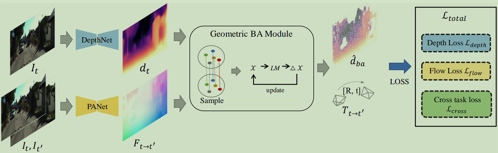

# Learning Generalized Visual Odometry Using Position-Aware Optical Flow and Geometric Bundle Adjustment

Created by [Yijun Cao](https://github.com/cyj5030).

### [Paper](https://www.sciencedirect.com/science/article/abs/pii/S0031320322007415)
### [arxiv](https://arxiv.org/abs/2111.11141)



## Citation
If you like our work and use the code or models for your research, please cite our work as follows.
```
@article{cao2022learning,
    title = {Learning generalized visual odometry using position-aware optical flow and geometric bundle adjustment},
    journal = {Pattern Recognition},
    volume = {136},
    pages = {109262},
    year = {2023},
    issn = {0031-3203},
    doi = {https://doi.org/10.1016/j.patcog.2022.109262},
}
```

## Prerequisites
We only tested in environment: Ubuntu 18.04, CUDA 11.0, python 3.8.15, pytorch 1.7.1.

Note: I don't know why the VO performance drops when pytorch version is larger or equal than 1.8.0.

## Data Download 
* For training KITTI depth, optical flow tasks, download KITTI raw dataset using the [script](https://www.cvlibs.net/download.php?file=raw_data_downloader.zip) provided on the official website. 

* For training KITTI Odometry task, download [KITTI Odometry dataset](http://www.cvlibs.net/datasets/kitti/eval_odometry.php).

* For evaluating optical flow, you need to download [KITTI 2015 dataset](https://www.cvlibs.net/datasets/kitti/eval_scene_flow.php?benchmark=flow).

* For evaluating depth, you need to use eigen split in `data/prepare/test_files.txt` and the ground truth `data/prepare/gt_depths.npz`.

## Data Preparation 
After download the raw dataset and unzip them, we need to select the non-static frames for training, run
```bash 
python data/prepare/kitti_raw.py
```

If you want to generate the noise data, see `data/prepare/kitti_odo_ex_gray.py` and `data/prepare/kitti_odo_ex.py`.


## Inference Using Pretrained Model
We provide pretrained models [here]() for different tasks. The performance could be slightly different with the paper due to randomness. 

0. To evaluate the prediction, we first need modifiy the items `kitti_raw`, `kitti_raw_prepare`, `kitti_flow_2012`, `kitti_flow_2015`, `kitti_odometry` from the config file in `config/kitti.yaml`. These items is the corresponding dataset path for your own. `kitti_raw_prepare` is the path point to the your generate by `data/prepare/kitti_raw.py`

1. To evaluate the monocular depth estimation on kitti eigen test split, run:
```bash
python test.py -ckpt_file path_to_your_model -output_file path_to_output_folder -Train_Eval depth -device cuda:{gpu_id}
```

2. To evaluate the optical flow estimation on kitti 2015, run:
```bash
python test.py -ckpt_file path_to_your_model -output_file path_to_output_folder -Train_Eval flow -device cuda:{gpu_id}
```

3. To evaluate the VO on kitti odometry dataset, run:
```bash
python test.py -ckpt_file path_to_your_model -output_file path_to_output_folder -Train_Eval vo -device cuda:{gpu_id}
```

3. To evaluate the noise VO on kitti odometry dataset, run:
```bash
python test.py -ckpt_file path_to_your_model -output_file path_to_output_folder -Train_Eval vo-robust -device cuda:{gpu_id}
```

## Training
To reproduce the performance, we recommend that users try multiple training sessions.

1. 1st optical flow training, first modify the item `model: flow`, ` Train_Eval: flow` `log_name:path_to_your_saved_folder`, `log_path: path_to_your_saved_folder` in `config/kitti.yaml` and then run:
```bash
python train.py -config ./config/kitti.yaml
```

2. depth training, first modify the item `model: depth`, ` Train_Eval: depth` `log_name:path_to_your_saved_folder`, `log_path: path_to_your_saved_folder` in `config/kitti.yaml` and then run:
```bash
python train.py -config ./config/kitti.yaml
```

3. fine-tuning optical flow, first modify the item `model: flow-ft`, ` Train_Eval: flow` `log_name:path_to_your_saved_folder`, `log_path: path_to_your_saved_folder`, `reuse_root: the 1st output folder` in `config/kitti.yaml` and then run:
```bash
python train.py -config ./config/kitti.yaml
```

For training with odometry dataset, modify `Train_Eval: vo` item in config file. 

## License

The codes and the pretrained model in this repository are under the BSD 2-Clause "Simplified" license as specified by the LICENSE file. 

## Related Projects
[Digging into Self-Supervised Monocular Depth Prediction](https://github.com/nianticlabs/monodepth2) 

[Towards Better Generalization: Joint Depth-Pose Learning without PoseNet
](https://github.com/B1ueber2y/TrianFlow).

